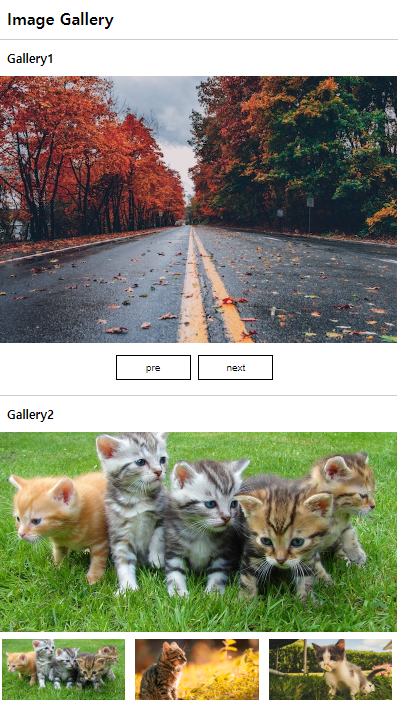

<h2>이미지 갤러리1</h2>
  <h3>Gallery1</h3>
  <h4>주요기능: 이전/다음 버튼으로 사진이 넘어감</h4>
  <ul>
    <li>방향(0=이전,1=다음)을 매개변수로 설정</li>
    <li>이미지에 번호를 부여해 이미지 최대 숫자를 초과하지 않도록 설정</li>
  </ul>
  <h3>Gallery2</h3>
  <h4>주요기능: 썸네일 이미지를 클릭하면 해당 이미지가 메인이미지에 표시됨</h4>
  

  <h3>산출물 이미지</h3>
  
